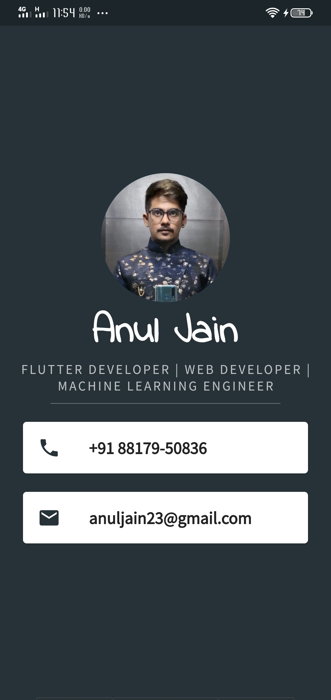

<h1>Flutter-development</h1>

Learning to build basic flutter apps from scratch.

# I_am_rich

A new Flutter application.

## Getting Started

This project is a starting point for a Flutter application.

A few resources to get you started if this is your first Flutter project:

- [Lab: Write your first Flutter app](https://flutter.dev/docs/get-started/codelab)
- [Cookbook: Useful Flutter samples](https://flutter.dev/docs/cookbook)

For help getting started with Flutter, view our
[online documentation](https://flutter.dev/docs), which offers tutorials,
samples, guidance on mobile development, and a full API reference.

# Basic_card_flutter

This app is build to display my card

# Dicee

## Our Goal

The objective of this tutorial is to introduce you to the core programming concepts that will form the foundation of most of the apps you’ll build in the future. This app will teach you how to make apps with functionality using setState() inside Stateful Flutter widgets.

## What you will create

We’re going to make a Las Vegas dice app. You can make the die roll at the press of a button. With this app in your pocket, you’ll be able to settle any score on the go!

# Magic 8 Ball

## Our Goal

The objective of this challenge is to solidify what you've learn't in the Dicee tutorial. This app will guide you through the steps required to build an 8 ball app and you will be applying what you have learnt about Stateless and Stateful Flutter widgets.

## What you will create

We’re going to make a magical 8 ball app, it will give you the answers to all the tricky questions in life. You can make the ball change at the press of a button.

# Xylophone

## Our Goal

In this tutorial we will be diving into more Dart programming concepts and learning how to use open source Flutter packages. By the end of this module, you should be comfortable using Flutter packages and building repeated widgets.

## What you will create

We’re going to make a music app that plays Xylophone sounds. For every Beethoven out there, this will let you unleash your musical talent where ever you are.

# Quizzler

## Our Goal

In this tutorial we will be reviewing Stateful and Stateless Widgets as well as learning about the fundamental building blocks of Object Oriented Programming (OOP) - Classes and Objects.

## What you will create

We’re going to make a quiz app that tests your general knowledge. As one of the most popular types of apps on the app stores, you can create your own quiz for other people to enjoy!

# Destini

## Our Goal

In this challenge, you will be building a choose your own adventure game like Bandersnatch. In the process, you should apply your knowledge from the last module (Quizzler) to use Dart OOP principles to build a well organised project.

# BMI Calculator

## Our Goal

The objective of this tutorial is to look at how we can customise Flutter Widgets to achieve our own beautiful user interface designs. If you have a designer on board, no matter how unconventional their designs are, we can create them using Flutter.

## What you will create

We’re going to make a Body Mass Index Calculator inspired by the beautiful designs made by [Ruben Vaalt](https://dribbble.com/shots/4585382-Simple-BMI-Calculator). It will be a multi screen app with simple functionality but full-on custom styling.

# Clima

## Our Goal

The objective of this tutorial is to learn about asynchronous programming in Dart. We'll look at how to carry out time consuming tasks such as getting device location and networking to get data from the internet.

## What you will create

We’re going to make a weather app inspired by the beautiful designs made by [Olia Gozha](https://dribbble.com/shots/4663154-). By the end of the module, you'll be able to find out the live weather data in the current location of the device as well as the weather for any city you can think of!

